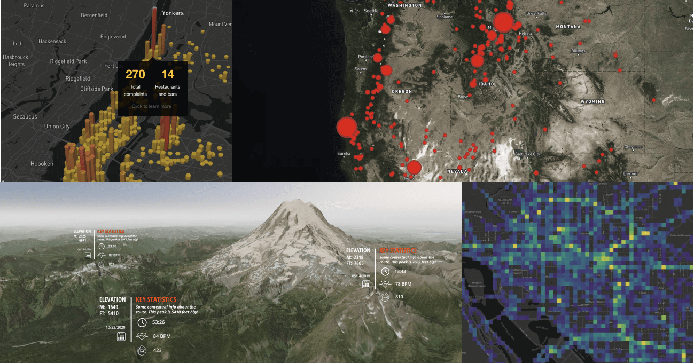

# Getting Started


### Solid Mapbox GL JS

[ ](https://www.npmjs.com/package/solid-map-gl) [](LICENSE/) [ ](https://bundlephobia.com/package/solid-map-gl) 

[Solid](https://www.solidjs.com/) Component Library for [Mapbox GL JS.](https://github.com/mapbox/mapbox-gl-js) Mapbox GL JS is a JavaScript library that renders interactive maps from vector tiles and Mapbox styles using WebGL. This project is intended to be as close as possible to the [Mapbox GL JS API.](https://docs.mapbox.com/mapbox-gl-js/api/)

[**Examples & Playground**](https://determined-mirzakhani-29bbc7.netlify.app)

* [Installation](./#installation)
* [Components](./#components)
* [Usage](./#usage)
  * [Static Map](./#static-map)
  * [Interactive Map](./#interactive-map)
  * [Map with Source and Layer](./#map-with-source-and-layer)
  * [Map with GeoJSON Source](./#map-with-geojson-source)
* [Roadmap](./#roadmap)



#### Installation

> :bangbang:
>
> There is a Mapbox bundle issue when using `npm or yarn`
>
> Please use [`pnpm`](https://pnpm.io/) as a workaround

```shell
pnpm add solid-map-gl
```

#### Components

| Component                            | Description                                                                                                            |
| ------------------------------------ | ---------------------------------------------------------------------------------------------------------------------- |
| [MapGL](src/components/MapGL/)       | Represents map on the page                                                                                             |
| [Source](src/components/Source/)     | [Sources](https://docs.mapbox.com/mapbox-gl-js/api/#sources) specify the geographic features to be rendered on the map |
| [Layer](src/components/Layer/)       | [Layers](https://docs.mapbox.com/mapbox-gl-js/style-spec/#layers) specify the `Sources` style                          |
| [Sky](src/components/Sky/)           | Specify the Sky Layer                                                                                                  |
| [Fog](src/components/Fog/)           | Specify the Fog Layer                                                                                                  |
| [Terrain](src/components/Terrain/)   | Specify the Terrain Layer                                                                                              |
| [Image](src/components/Image/)       | Adds an image to the map style                                                                                         |
| [Popup](src/components/Popup/)       | Component for [Mapbox GL JS Popup](https://docs.mapbox.com/mapbox-gl-js/api/#popup)                                    |
| [Marker](src/components/Marker/)     | Component for [Mapbox GL JS Marker](https://docs.mapbox.com/mapbox-gl-js/api/#marker)                                  |
| [Control](src/components/control.md) | Represents the map's control                                                                                           |

#### Usage

To use any of Mapbox’s tools, APIs, or SDKs, you’ll need a Mapbox [access token](https://www.mapbox.com/help/define-access-token/). Mapbox uses access tokens to associate requests to API resources with your account. You can find all your access tokens, create new ones, or delete existing ones on your [API access tokens page](https://www.mapbox.com/studio/account/tokens/).

**Static Map**

By default, `MapGL` component renders in a static mode. That means that the user cannot interact with the map.

```jsx
import MapGL from 'solid-map-gl'
<MapGL
  options={{
    accessToken: MAPBOX_ACCESS_TOKEN,
    style: 'mapbox://styles/mapbox/light-v10',
  }}
  viewport={{
    center: [-122.41, 37.78],
    zoom: 11,
  }}>
</MapGL>
```

**Interactive Map**

In most cases, you will want the user to interact with the map. To do this, you need to provide `onViewportChange` handler, that will update the map's viewport state.

```jsx
import { createSignal } from 'solid-js'
import MapGL from 'solid-map-gl'
import type { Viewport } from 'solid-map-gl'

const [viewport, setViewport] = createSignal({
    center: [-122.41, 37.78],
    zoom: 11
} as Viewport);

<MapGL
    options={{
        accessToken: MAPBOX_ACCESS_TOKEN,
        style: 'mapbox://styles/mapbox/light-v10'
    }}
    viewport={viewport()}
    onViewportChange={evt => setViewport(evt)}>
</MapGL>
```

**Map with Source and Layer**

[Sources](https://docs.mapbox.com/mapbox-gl-js/api/sources/) specify the geographic features to be rendered on the map.

[Layers](https://docs.mapbox.com/mapbox-gl-js/style-spec/layers/) specify the Sources styles. The type of layer is specified by the `"type"` property in the layers style object, and must be one of `background`, `fill`, `line`, `symbol`, `raster`, `circle`, `fill-extrusion`, `heatmap`, `hillshade`.

Except for layers of the `background` type, each layer needs to refer to a source. Either buy referencing the `id` in `sourceId` or by nesting the layer within the source component. Layers take the data that they get from a source, optionally filter features, and then define how those features are styled.

```jsx
import MapGL, { Source, Layer } from 'solid-map-gl';

<MapGL
    options={{
        accessToken: MAPBOX_ACCESS_TOKEN,
        style: 'mapbox://styles/mapbox/light-v10'
    }}>
    <Source
        source={{
        type: 'vector',
        url: 'mapbox://mapbox.mapbox-terrain-v2',
    }}>
        <Layer style={{
            type: 'line',
            'source-layer': 'contour'
            paint: {
                'line-color': '#877b59',
                'line-width': 1,
            }
        }} />
    </Source>
</MapGL>
```

**Map with GeoJSON Source**

To draw a GeoJSON on a map, add `Source` with the `type` property set to `geojson` and `data` property set to a URL or inline [GeoJSON](http://geojson.org/).

```jsx
import { createSignal } from 'solid-js'
import MapGL, { Source, Layer } from 'solid-map-gl'
import type { Viewport } from 'solid-map-gl'

const [viewport, setViewport] = createSignal({
  center: [-122.486052, 37.830348],
  zoom: 15,
})

const data = {
  type: 'Feature',
  geometry: {
    type: 'LineString',
    coordinates: [
      [-122.48369693756104, 37.83381888486939],
      [-122.48348236083984, 37.83317489144141],
      [-122.48339653015138, 37.83270036637107],
      [-122.48356819152832, 37.832056363179625],
      [-122.48404026031496, 37.83114119107971],
      [-122.48404026031496, 37.83049717427869],
      [-122.48348236083984, 37.829920943955045],
      [-122.48356819152832, 37.82954808664175],
      [-122.48507022857666, 37.82944639795659],
      [-122.48610019683838, 37.82880236636284],
      [-122.48695850372314, 37.82931081282506],
      [-122.48700141906738, 37.83080223556934],
      [-122.48751640319824, 37.83168351665737],
      [-122.48803138732912, 37.832158048267786],
      [-122.48888969421387, 37.83297152392784],
      [-122.48987674713133, 37.83263257682617],
      [-122.49043464660643, 37.832937629287755],
      [-122.49125003814696, 37.832429207817725],
      [-122.49163627624512, 37.832564787218985],
      [-122.49223709106445, 37.83337825839438],
      [-122.49378204345702, 37.83368330777276],
    ],
  },
}

<MapGL
  options={{
    accessToken: MAPBOX_ACCESS_TOKEN,
    style: 'mapbox://styles/mapbox/light-v10',
  }}
  viewport={viewport()}
  onViewportChange={evt => setViewport(evt)}>
  <Source
    source={{
      type: 'geojson',
      data: { data },
    }}>
    <Layer
      style={{
        type: 'line',
        layout: {
          'line-join': 'round',
          'line-cap': 'round',
        },
        paint: {
          'line-color': '#888',
          'line-width': 8,
        },
      }}
    />
  </Source>
</MapGL>
```

**Custom Layers support**

[Custom layers](https://docs.mapbox.com/mapbox-gl-js/api/properties/#customlayerinterface) allow a user to render directly into the Map's GL context using the map's camera.

Here is an example using [deck.gl.](https://github.com/uber/deck.gl)

```jsx
import { createSignal } from 'solid-js'
import MapGL, { Source, Layer } from 'solid-map-gl'
import { MapboxLayer } from '@deck.gl/mapbox'
import { ScatterplotLayer } from '@deck.gl/layers'
import type { Viewport } from 'solid-map-gl'

const [viewport, setViewport] = createSignal({
  center: [-74.5, 40],
  zoom: 9,
})

const myDeckLayer = new MapboxLayer({
  id: 'my-scatterplot',
  type: ScatterplotLayer,
  data: [{ position: [-74.5, 40], size: 1000 }],
  getPosition: d => d.position,
  getRadius: d => d.size,
  getColor: [255, 0, 0],
})

<MapGL
  options={{
    accessToken: MAPBOX_ACCESS_TOKEN,
    style: 'mapbox://styles/mapbox/light-v10',
  }}
  viewport={viewport()}
  onViewportChange={evt => setViewport(evt)}>
  <Layer customLayer={myDeckLayer} />
</MapGL>
```

#### Roadmap

* [x] Basic Mapbox GL Functionality
* [x] Include Map Controls
* [x] Include Fog, Sky, and Terrain
* [x] Include Popup and Markers
* [x] Minify bundle & reduce size
* [x] Add basemap switching
* [x] Include event handling
* [x] Sync Maps
* [ ] Add draw functionality
